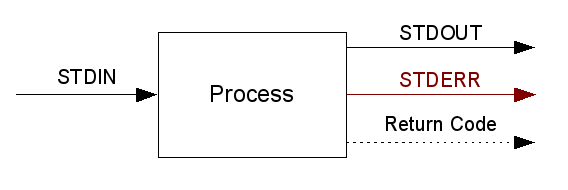

*********
Processes
*********
Let's talk about processes from a shell point of view.

A process takes standard input (STDIN) and returns

- standard output (STDOUT) - it gets printed on your console
- standard error (STDERR) - you see that too if you don't do ``process 2> /dev/null``, but more about that later
- return code - ``0`` on success, a different number otherwise

Of course there are processes that

- do not read STDIN (but instead read files, get data from the kernel, ...)
- do not write to STDOUT (because they don't have anything to say)
- do not write to STDERR (because there are no errors)

But *every process* returns a return code.

There are environment variables too.

In the next sections I'll show you how to use that knowledge with Bash and Python.

Bash
====
I could not do better than the |ABS|, so I will simply present a basic example. Just paste it line by line into your running shell.

.. |ABS| replace:: `Advanced Bash Scripting Guide <http://tldp.org/LDP/abs/html/index.html>`__

.. literalinclude:: processes.sh
    :language: bash

Python
======
We know how to write stuff to STDIN and STDERR, how to set a return code and how to read STDOUT, STDERR and return codes. Let's do that in Python!

Here is a process that can do all that:

.. literalinclude:: processes.py
    :language: python

.. highlight:: bash

Use it like this::

    echo 'spam' | ./processes.py
    echo $?

But how do we communicate with other processes, i.e. be the one controlling others? Here's an example:

.. literalinclude:: subprocess_example.py
    :language: python

You can find more information in the official `Python Documentation <http://docs.python.org/library/subprocess.html>`__.
